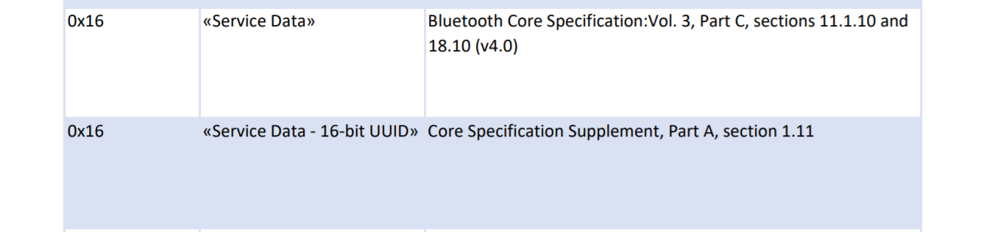

在 [Specifications Assigned Numbers](https://www.bluetooth.com/specifications/assigned-numbers/) 里搜索 Generic Access Profile 即可找到广播数据里各种 Data Type 在相应 Spec 的那一章节。

例如 «Service Data»：

去 [Specifications List](https://www.bluetooth.com/specifications/specs/?status=active&keyword=&filter=) 搜 Core Spec 以及 Supplement 文档，去相应章节就能够快速找到需要的点。

«Service Data» 类型的数据，是一个 service UUID，再加上自定义数据组成的。

«Manufacturer Specific Data» 类型的数据，是由 2 字节的厂商标识符，再加上厂商自定义数据组成。

Mi Beacon 的格式如下：

| Length | AD Type                            | AD Data                      |
| ------ | ---------------------------------- | ---------------------------- |
| N      | «Service Data» (0x16)              | Mi Service(0xFE95)，Mi Data  |
| N      | «Manufacturer Specific Data»(0xFF) | Mi Specific(0x038F)，Mi Data |

- Advertising 中需要包含 «Service Data»，且后面紧跟着 Mi Service(0xFE95)。
- Scan Response 中需要包含 «Manufacturer Specific Data»，且后面紧跟着 Mi Specific(0x038F) 。

这里的 Mi Data 就是小米公司指定的 beacon 格式，

|     名称      |  类型  | 长度 | 是否强制 |          说明          |
| :-----------: | :----: | :--: | :------: | :--------------------: |
| Frame Control | Bitmap |  2   |    是    |         控制位         |
|  Product ID   |  U16   |  2   |    是    |       产品唯一ID       |
| Frame Counter |   U8   |  1   |    是    |     序号(用于去重)     |
|  MAC Address  |   U8   |  6   |    否    |      设备MAC地址       |
|  Capability   |   U8   |  1   |    否    |        设备能力        |
|    Object     |   U8   |  N   |    否    |       事件或属性       |
| Random Number |   U8   |  3   |    否    | 若使用加密则为必选字段 |

MAC 地址有什么用，为了 ISO 识别此设备并连接。

加密？

绑定完成后还需要发 beacon 么？

mibeacon 解密。

Mi-Spec https://iot.mi.com/new/doc/design/spec/overall，

MiBeacon https://iot.mi.com/new/doc/embedded-development/ble/ble-mibeacon

GATT 标准属性。

Mi-Service https://www.bookstack.cn/read/miio_open/ble-Mi-Service.md

https://bbs.hassbian.com/thread-12843-1-1.html

ESPHome

