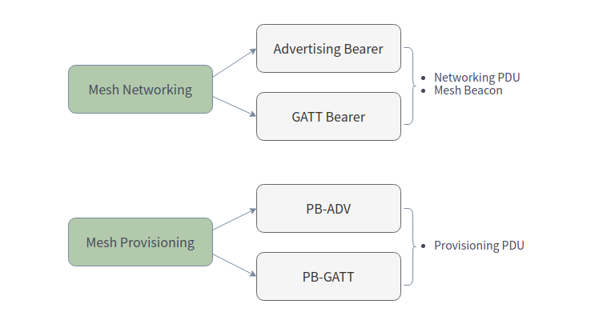
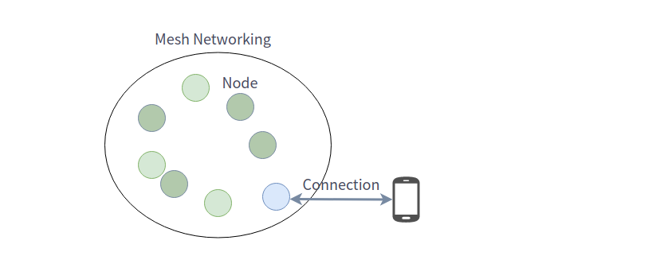
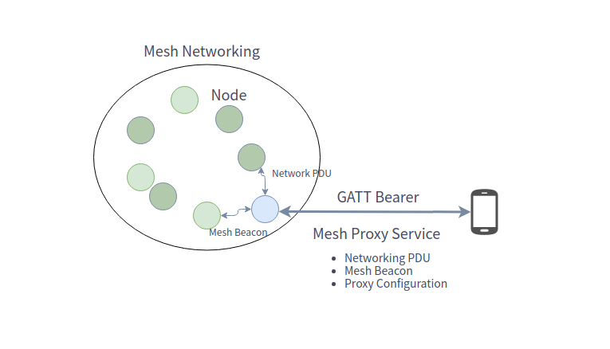
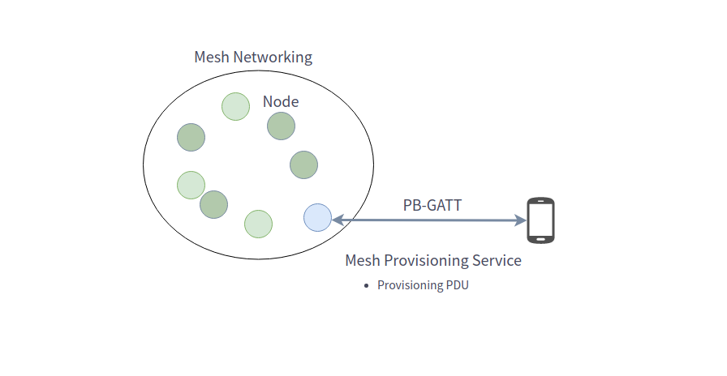

# Proxy protocol & Mesh GATT services

本文仅从全局的角度理解 Proxy protocol 和 Mesh GATT services，不涉及具体的细节，详细内容还是需要参考 Mesh Spec 。

-----

Mesh Networking 里面传输数据有两个承载层（Bearer），广播承载（Advertising Bearer）和 GATT 承载（GATT Bearer）。Mesh Provisioning 过程中也有两个承载层，PB-ADV 和 PB-GATT 。

- Mesh Networking 里在承载层上传输 Networking PDU 和 Mesh Beacon 。
- Mesh Provisioning 里在承载层上传输 Provisioning PDU 。

GATT Bearer 允许手机与 Mesh 网络里支持 Proxy 功能的节点建立连接，从而让手机间接加入 Mesh 网络，能够与网络中的其他节点通信。

Proxy protocol 则定义了手机和节点在连接通道上传输的数据格式，总共有 4 类：

- Network PDU
- Mesh Beacon
- Proxy Configuration
- Provisioning PDU

而能够承担传输数据任务的实体则是 GATT Service 和 Charateristic，Mesh 定义了两个 GATT Service：

- Mesh Proxy Service
- Mesh Provisioning Service

前面介绍的 GATT Bearer 其实就是指 Mesh Proxy Service，手机将需要发送的 Networking PDU，Mesh Beacon 发送给 Proxy 节点，由其通过 Advertising Bearer 发送给其他节点；当 Proxy 节点收到 Mesh Beacon，Network PDU 时也会通过 GATT Bearer 传输给手机。这样，手机就间接地参与了 Mesh 网络的通信。

而 PB-GATT 就是指 Mesh Provisioning Service，PB-GATT 仅在 Provisioning 过程中存在，此时手机充当 Provisioner 连接设备，并通过 Mesh Provisioning Service 与设备进行通信，传输 Provisioning PDU 。

**注意**：Mesh Provisiong Service 和 Mesh Proxy Service 不能同时在设备的 GATT Dataset 里存在。当设备处于 Unprovisioning 状态时，设备仅暴露 Mesh Provisiong Service 供手机使用。当设备完成 Provisioning 过程，变成 Mesh 网络里的节点后，仅暴露 Mesh Proxy Service 供手机使用。

