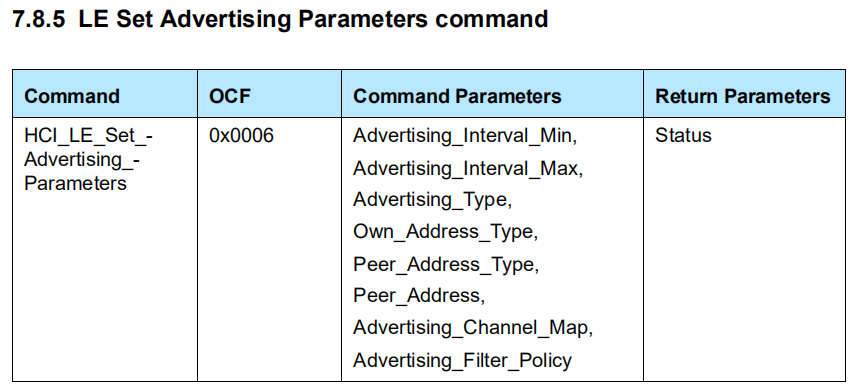
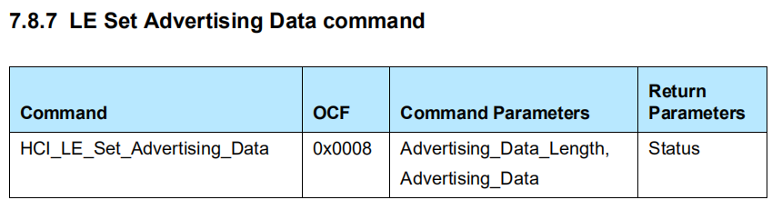
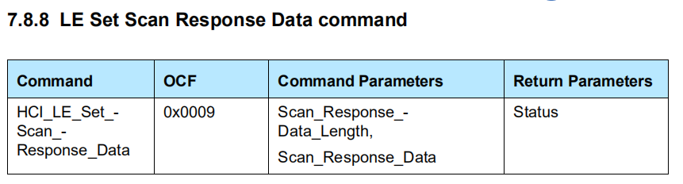
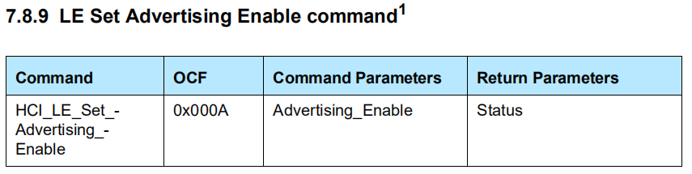

advertisement params

advertisement data

advertisement scanner dada

enable advertisement


`gap_advertisements_set_params()` ，`gap_scan_response_set_data()` ，`gap_advertisements_set_data()` ，`gap_advertisements_enable()` ，

```C
const uint8_t adv_data[] = {
    // Flags general discoverable, BR/EDR not supported
    0x02, BLUETOOTH_DATA_TYPE_FLAGS, 0x06, 
    // Name
    0x0b, BLUETOOTH_DATA_TYPE_COMPLETE_LOCAL_NAME, 'L', 'E', ' ', 'C', 'o', 'u', 'n', 't', 'e', 'r', 
    // Incomplete List of 16-bit Service Class UUIDs -- FF10 - only valid for testing!
    0x03, BLUETOOTH_DATA_TYPE_INCOMPLETE_LIST_OF_16_BIT_SERVICE_CLASS_UUIDS, 0x10, 0xff,
};

void gap_advertisements_set_data(uint8_t advertising_data_length, uint8_t * advertising_data);
void gap_scan_response_set_data(uint8_t scan_response_data_length, uint8_t * scan_response_data);

void gap_advertisements_set_params(uint16_t adv_int_min, uint16_t adv_int_max, uint8_t adv_type,
	uint8_t direct_address_typ, bd_addr_t direct_address, uint8_t channel_map, uint8_t filter_policy);

void gap_advertisements_enable(int enabled);
```










更新广播数据怎么办？再次调用函数 `gap_scan_response_set_data()`即可，Spec 里有如下规定：

> If advertising is currently enabled, the Controller shall use the new data in subsequent advertising events. If an advertising event is in progress when this command is issued, the Controller may use the old or new data for that event.


ENABLE_LE_BLE

ENABLE_LE_PERIPHERAL

