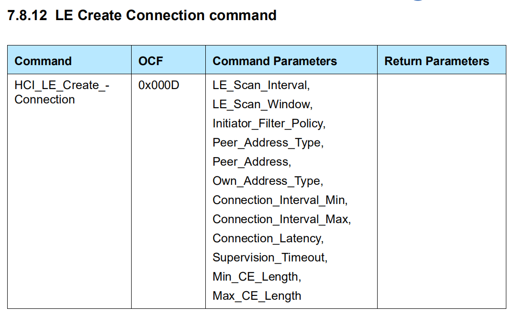
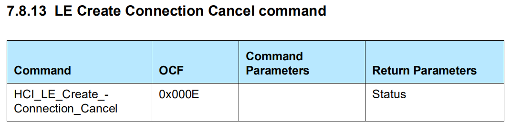
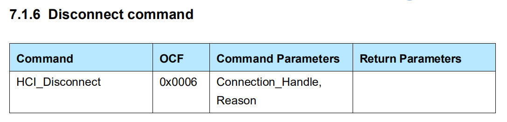
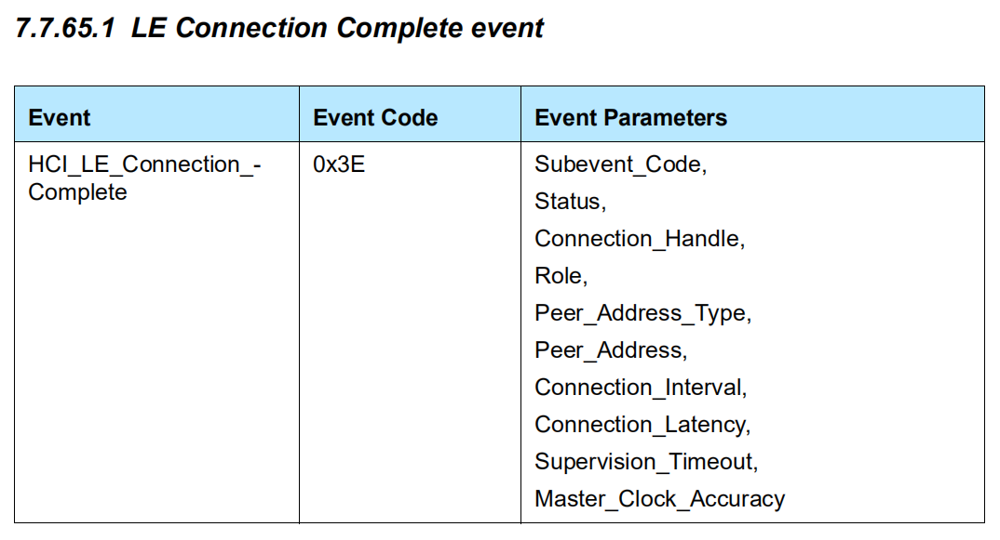
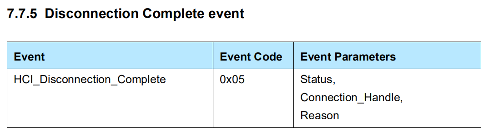

```C
/**
 * @brief Connect to remote LE device
 */
uint8_t gap_connect(const bd_addr_t addr, bd_addr_type_t addr_type);

/**
 *  @brief Connect with Whitelist
 *  @note Explicit whitelist management and this connect with whitelist replace deprecated gap_auto_connection_* functions
 *  @returns - if ok
 */
uint8_t gap_connect_with_whitelist(void);

/**
 * @brief Cancel connection process initiated by gap_connect
 */
uint8_t gap_connect_cancel(void);

/**
 * @brief Disconnect connection with handle
 * @param handle
 */
uint8_t gap_disconnect(hci_con_handle_t handle);
```










```C
#define HCI_EVENT_LE_META                                  0x3E

/** 
 * @format 11H11B2221
 * @param subevent_code
 * @param status
 * @param connection_handle
 * @param role
 * @param peer_address_type
 * @param peer_address
 * @param conn_interval
 * @param conn_latency
 * @param supervision_timeout
 * @param master_clock_accuracy
 */
#define HCI_SUBEVENT_LE_CONNECTION_COMPLETE                0x01
```

`hci_subevent_le_connection_complete_get_*()` 

HCI_EVENT_LE_META - HCI_SUBEVENT_LE_CONNECTION_COMPLETE



```C
/**
 * @format 121
 * @param status
 * @param connection_handle
 * @param reason 
 */
#define HCI_EVENT_DISCONNECTION_COMPLETE                   0x05
```

`hci_event_disconnection_complete_get_*()` 

