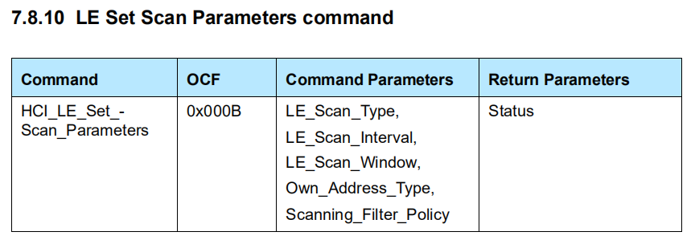
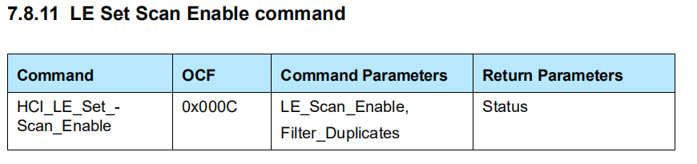
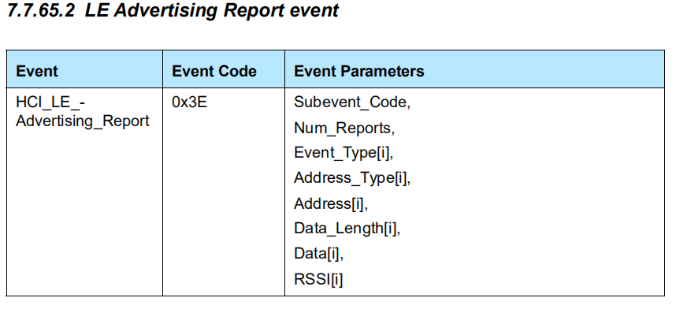

# GAP Observation

## 扫描获取数据

通过 `gap_set_scan_params()` 函数设置扫描参数，`gap_start_scan()` 函数开启扫描。

```C
void gap_set_scan_params(uint8_t scan_type, uint16_t scan_interval, uint16_t scan_window, uint8_t scanning_filter_policy);
void gap_start_scan(void);
```

其对应的 HCI 接口依次为：





然后需要注册一个 btstack 自定义的 HCI 事件回调函数，用于接收 GAP LE advertisements ，回调函数格式如下：

```C
void packet_handler(uint8_t packet_type, uint16_t channel, uint8_t *packet, uint16_t size)；
```

其中 `packet_type` 是指本次实际收到的 HCI 包类型，有 Command，ACL，SCO，Event 。

`packet` 就是自定义的 HCI 事件了，其类型为：*GAP_EVENT_ADVERTISING_REPORT* ，可以通过 `hci_event_packet_get_type()` 函数得到自定义 HCI 事件的类型。`size` 是 HCI 事件大小。

通过调试时的函数调用栈，可以看出 btstack 在收到 *LE_Advertising_Report_Event* 事件之后，



会调用下述代码：

```C
void le_handle_advertisement_report(uint8_t *packet, uint16_t size){

    int offset = 3;
    int num_reports = packet[offset];
    offset += 1;

    int i;
    // log_info("HCI: handle adv report with num reports: %d", num_reports);
    uint8_t event[12 + LE_ADVERTISING_DATA_SIZE]; // use upper bound to avoid var size automatic var
    for (i=0; (i<num_reports) && (offset < size);i++){
        // sanity checks on data_length:
        uint8_t data_length = packet[offset + 8];
        if (data_length > LE_ADVERTISING_DATA_SIZE) return;
        if ((offset + 9u + data_length + 1u) > size)    return;
        // setup event
        uint8_t event_size = 10u + data_length;
        int pos = 0;
        event[pos++] = GAP_EVENT_ADVERTISING_REPORT;
        event[pos++] = event_size;
        (void)memcpy(&event[pos], &packet[offset], 1 + 1 + 6); // event type + address type + address
        offset += 8;
        pos += 8;
        event[pos++] = packet[offset + 1 + data_length]; // rssi
        event[pos++] = data_length;
        offset++;
        (void)memcpy(&event[pos], &packet[offset], data_length);
        pos +=    data_length;
        offset += data_length + 1u; // rssi
        hci_emit_event(event, pos, 1);
    }
}
```

其核心用途就是将 *LE_Advertising_Report_Event* 事件一次上报的多个 report 分开，组成单个的自定义 HCI 事件分多次传上层。其向上传的数据格式为：

|     0      |     1      |           2            |      3       |   4~9   |  10  |     11      | 12~12+data_length-1 |
| :--------: | :--------: | :--------------------: | :----------: | :-----: | :--: | :---------: | :-----------------: |
| event type | event size | advertising event type | address type | address | rssi | data_length |        data         |

*GAP_EVENT_ADVERTISING_REPORT*  这个自定义的 HCI 事件数据格式描述如下：

```C
/**
 * @format 11B1JV
 * @param advertising_event_type
 * @param address_type
 * @param address
 * @param rssi
 * @param data_length
 * @param data
 */
#define GAP_EVENT_ADVERTISING_REPORT                          0xE2
```

其中 format 为 `11B1JV`，在代码 hci_event.c 里可以找到 Event 中这个格式的意思：

```C
/**
 * construct HCI Event based on template
 *
 * Format:
 *   1,2,3,4: one to four byte value
 *   H: HCI connection handle
 *   B: Bluetooth Baseband Address (BD_ADDR)
 *   D: 8 byte data block
 *   P: 16 byte data block.
 *   Q: 32 byte data block, e.g. for X and Y coordinates of P-256 public key
 *   J: 1-byte lenght of following variable-length data blob 'V'
 *   K: 1-byte length of following variable-length data blob 'V', length is not included in packet
 *   V: variable-length data blob of len provided in 'J' field
 */
```

于是 `11B1JV` 可以理解为：1 byte, 1 byte, BD_ADDR, 1 byte, 1 byte（'V' 格式数据的大小）, n bytes（由 'J' 决定大小）。

*GAP_EVENT_ADVERTISING_REPORT* 事件里的相应数据可以通过 btstack_event.h 里的相关函数调用：

- `gap_event_advertising_report_get_advertising_event_type()` 获取广播事件类型。
- `gap_event_advertising_report_get_address_type()` 获取地址类型。
- `gap_event_advertising_report_get_address()` 函数获取地址。
- `gap_event_advertising_report_get_rssi()` 获取 rssi 。
- `gap_event_advertising_report_get_data_length()` 获取广播数据长度。
- `gap_event_advertising_report_get_data()` 获取广播数据。

其实还是挺有规律的，把事件 *GAP_EVENT_ADVERTISING_REPORT* 的名称都换成小写，`gap_event_advertising_export_*()` 就是针对该事件数据的特定操作。 

## 处理广播数据

得到了原始的广播数据流，如何将其变成 AD Struct 类型结构呢？

btstack 提供了一种迭代器机制，通过 `ad_iterator_init()` 初始化迭代器，`ad_iterator_has_more()` 判断迭代器是否还有内容，`ad_iterator_next()` 获取下一个迭代器，这三个函数用于 for 循环，就可以遍历整个数据流了。然后针对每个迭代器，可以用 `ad_iterator_get_data_type()` 获取广播数据类型，`ad_iterator_get_data_len()` 函数获取广播数据长度，`ad_iterator_get_data()` 获取广播数据。

## 宏配置

```C
#define ENABLE_BLE	1
#define ENABLE_LE_CENTRAL	1
```


---

至此，btstack 提供的 GAP Observation 操作基本就介绍完毕了，还是比较清晰的。

