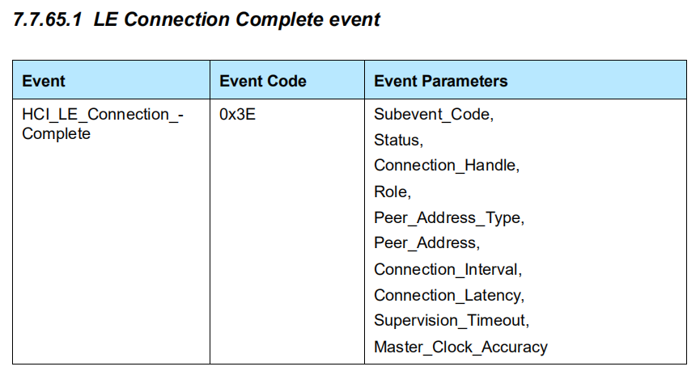
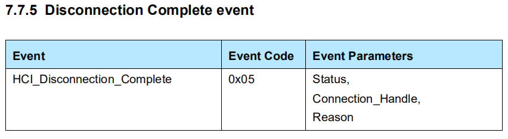

GAP Peripheral 首先需要扮演 GAP Broadcaster 的角色，不断地发送广播包，等到被 GAP Central 连接后，扮演 GATT Server 的角色。

HCI Event：

- Event Code - *HCI_EVENT_LE_META(0x3E)*
- Subevent_Code - *HCI_SUBEVENT_LE_CONNECTION_COMPLETE(0x01)*

`hci_subevent_le_connection_complete_*` 提供了操作的相关函数。

HCI Event：

- Event Code - *HCI_EVENT_DISCONNECTION_COMPLETE(0x05)*

