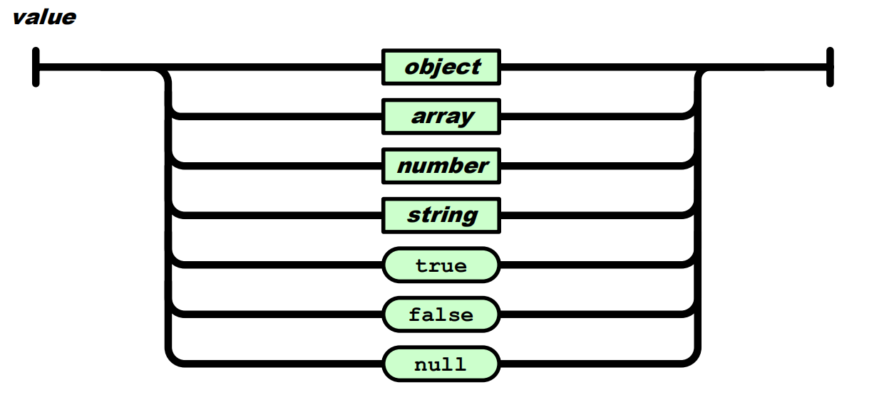
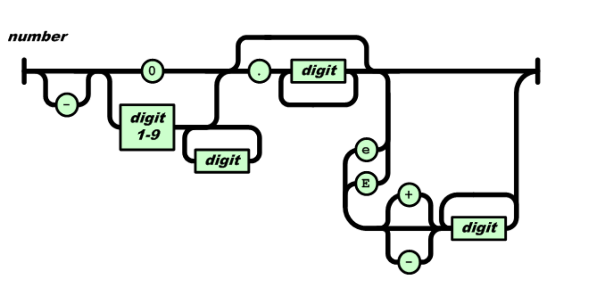
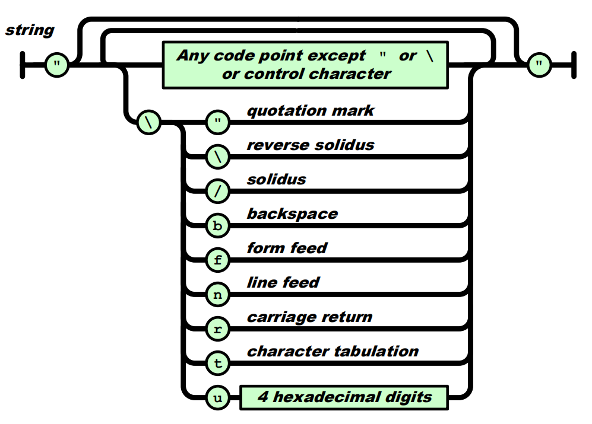
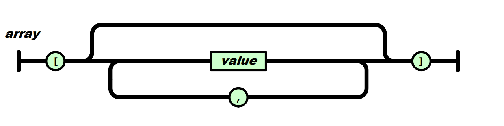
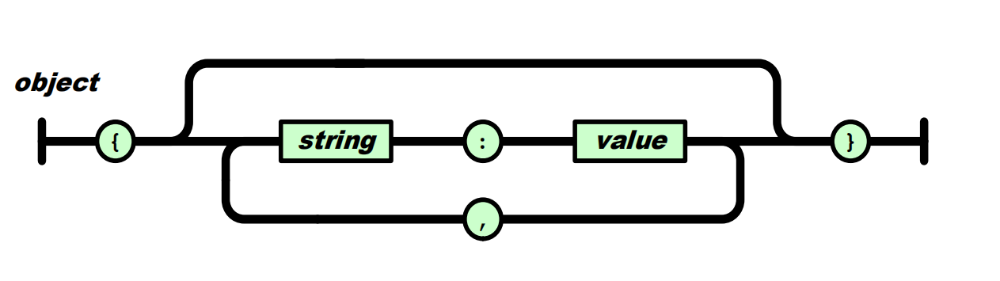
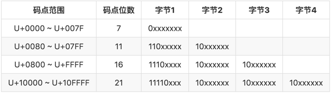

# json-tutorial

- [从零开始的 JSON 库教程](https://zhuanlan.zhihu.com/json-tutorial)
- [Introducing JSON](https://www.json.org/json-en.html)
- [json-tutorial](https://github.com/miloyip/json-tutorial)
- [cJSON](https://github.com/DaveGamble/cJSON)
- [Augmented BNF for Syntax Specifications: ABNF](https://tools.ietf.org/html/rfc5234)
- [RapidJSON文档](http://miloyip.github.io/rapidjson/zh-cn/)

学习目标：

- 掌握手写递归下降解析器（类似状态机）
- 掌握测试驱动开发（TDD）
- 掌握单元测试
- 理解 Unicode 和 UTF-8
- 理解浮点数
- 了解 ABNF
- 了解 Linux 平台下内存泄漏查找工具（valgrind）

## 测试驱动开发（TDD）

一般来说，软件开发是以周期进行的。

1. 加入一个测试。
2. 运行所有测试，新的测试应该会失败。
3. 编写实现代码。
4. 运行所有测试，若有测试失败回到3。
5. 重构代码。
6. 回到 1。

重构：DRY（don't repeat yourself）原则

了解功能原理 -> 设计 API -> 添加单元测试 -> 实现功能 。

## JSON 语法子集

JSON 的值（value）语法如下图所示：



使用 ABNF 形式描述：

```text
JSON-text = ws value ws
ws = *(%x20 / %x09 / %x0A / %x0D)
value = null / false / true / number / string / array / object
null  = "null"
false = "false"
true  = "true"

number = [ "-" ] int [ frac ] [ exp ]
int = "0" / digit1-9 *digit
frac = "." 1*digit
exp = ("e" / "E") ["-" / "+"] 1*digit

string = quotation-mark *char quotation-mark
char = unescaped /
   escape (
       %x22 /          ; "    quotation mark  U+0022
       %x5C /          ; \    reverse solidus U+005C
       %x2F /          ; /    solidus         U+002F
       %x62 /          ; b    backspace       U+0008
       %x66 /          ; f    form feed       U+000C
       %x6E /          ; n    line feed       U+000A
       %x72 /          ; r    carriage return U+000D
       %x74 /          ; t    tab             U+0009
       %x75 4HEXDIG )  ; uXXXX                U+XXXX
escape = %x5C          ; \
quotation-mark = %x22  ; "
unescaped = %x20-21 / %x23-5B / %x5D-10FFFF

array = %x5B ws [ value *( ws %x2C ws value ) ] ws %x5D

member = string ws %x3A ws value
object = %x7B ws [ member *( ws %x2C ws member ) ] ws %x7D
```

### null & true & false

null, true, false 就是其字面值。

### number

JSON 完整的 number 语法如下图所示：



**如何校验一个 number 的正确性？**

从字符串的最开始处，按照上述的语法图，一个字节一个字节的去校验。

```C
#define ISDIGIT(ch)         ((ch) >= '0' && (ch) <= '9')
#define ISDIGIT1TO9(ch)     ((ch) >= '1' && (ch) <= '9')
static int lept_parse_number(lept_context* c, lept_value* v) {
    const char* p = c->json;
    if (*p == '-') p++;
    if (*p == '0') p++;
    else {
        if (!ISDIGIT1TO9(*p)) return LEPT_PARSE_INVALID_VALUE;
        for (p++; ISDIGIT(*p); p++);
    }
    if (*p == '.') {
        p++;
        if (!ISDIGIT(*p)) return LEPT_PARSE_INVALID_VALUE;
        for (p++; ISDIGIT(*p); p++);
    }
    if (*p == 'e' || *p == 'E') {
        p++;
        if (*p == '+' || *p == '-') p++;
        if (!ISDIGIT(*p)) return LEPT_PARSE_INVALID_VALUE;
        for (p++; ISDIGIT(*p); p++);
    }
    ......
}
```

### string

JSON 完整的 string 语法如下图所示：



### array



### object



## 手写递归下降解析器

对 JSON 值类型的解析比较简单，跳过空白字符后，只需检测下一个字符，就可以知道它是哪种类型的值。

- n ➔ null
- t ➔ true
- f ➔ false
- " ➔ string
- 0-9/- ➔ number
- [ ➔ array
- { ➔ object

### null & true & false

对于 null, true, false 值来说，根据首字符判断出相应类型后，依次校验剩下的字符即可。

```C
static int lept_parse_null(lept_context* c, lept_value* v) {
    EXPECT(c, 'n');
    if (c->json[0] != 'u' || c->json[1] != 'l' || c->json[2] != 'l')
        return LEPT_PARSE_INVALID_VALUE;
    c->json += 3;
    ......
}
static int lept_parse_true(lept_context* c, lept_value* v) {
    EXPECT(c, 't');
    if (c->json[0] != 'r' || c->json[1] != 'u' || c->json[2] != 'e')
        return LEPT_PARSE_INVALID_VALUE;
    c->json += 3;
    ......
}
static int lept_parse_false(lept_context* c, lept_value* v) {
    EXPECT(c, 'f');
    if (c->json[0] != 'a' || c->json[1] != 'l' || c->json[2] != 's' || c->json[3] != 'e')
        return LEPT_PARSE_INVALID_VALUE;
    c->json += 4;
    ......
}
```


### number

number 解析比较复杂，先校验了 number 的语法正确性，然后在利用 `strtod()` 来讲 10 进制字符串数字转换成双精度浮点数。

```C
static int lept_parse_number(lept_context* c, lept_value* v) {
    const char* p = c->json;
    if (*p == '-') p++;
    if (*p == '0') p++;
    else {
        if (!ISDIGIT1TO9(*p)) return LEPT_PARSE_INVALID_VALUE;
        for (p++; ISDIGIT(*p); p++);
    }
    if (*p == '.') {
        p++;
        if (!ISDIGIT(*p)) return LEPT_PARSE_INVALID_VALUE;
        for (p++; ISDIGIT(*p); p++);
    }
    if (*p == 'e' || *p == 'E') {
        p++;
        if (*p == '+' || *p == '-') p++;
        if (!ISDIGIT(*p)) return LEPT_PARSE_INVALID_VALUE;
        for (p++; ISDIGIT(*p); p++);
    }
    errno = 0;
    v->n = strtod(c->json, NULL);
    if (errno == ERANGE && (v->n == HUGE_VAL || v->n == -HUGE_VAL))
        return LEPT_PARSE_NUMBER_TOO_BIG;
    v->type = LEPT_NUMBER;
    c->json = p;
    return LEPT_PARSE_OK;
}
```

### string

核心就是一个字节一个字节的处理，遇到 **'\\'** 字符需要处理转义。leptjson 里还添加了动态字符串和内存管理的内容。

```C
static int lept_parse_string(lept_context* c, lept_value* v) {
    size_t head = c->top, len;
    const char* p;
    EXPECT(c, '\"');
    p = c->json;
    for (;;) {
        char ch = *p++;
        switch (ch) {
            case '\"':
                len = c->top - head;
                lept_set_string(v, (const char*)lept_context_pop(c, len), len);
                c->json = p;
                return LEPT_PARSE_OK;
            case '\0':
                c->top = head;
                return LEPT_PARSE_MISS_QUOTATION_MARK;
            case '\\':
                ch = *p++;
                switch (ch) {
                    case '\"':  PUTC(c, '\"');  break;
                    case '\\':  PUTC(c, '\\');  break;
                    case '/':   PUTC(c, '/');   break;
                    case 'b':   PUTC(c, '\b');  break;
                    case 'f':   PUTC(c, '\f');  break;
                    case 'n':   PUTC(c, '\n');  break;
                    case 'r':   PUTC(c, '\r');  break;
                    case 't':   PUTC(c, '\t');  break;
                    case 'u':   break;
                    default:
                        c->top = head;
                        return LEPT_PARSE_INVALID_STRING_ESCAPE;
                }
                break;
            default:
                if ((unsigned char)ch < '\x20') {
                    c->top = head;
                    return LEPT_PARSE_INVALID_STRING_CHAR;
                }
                PUTC(c, ch);
        }
    }
}
```

## 内存泄漏查找工具（valgrind）

使用例子：

```shell
ubuntu@VM-16-6-ubuntu:~/C/json-tutorial/tutorial03/build$ valgrind --leak-check=full ./leptjson_test 
==12462== Memcheck, a memory error detector
==12462== Copyright (C) 2002-2017, and GNU GPL'd, by Julian Seward et al.
==12462== Using Valgrind-3.13.0 and LibVEX; rerun with -h for copyright info
==12462== Command: ./leptjson_test
==12462== 
160/160 (100.00%) passed
==12462== 
==12462== HEAP SUMMARY:
==12462==     in use at exit: 2 bytes in 1 blocks
==12462==   total heap usage: 14 allocs, 13 frees, 2,096 bytes allocated
==12462== 
==12462== 2 bytes in 1 blocks are definitely lost in loss record 1 of 1
==12462==    at 0x4C31B0F: malloc (in /usr/lib/valgrind/vgpreload_memcheck-amd64-linux.so)
==12462==    by 0x10F584: lept_set_string (leptjson.c:212)
==12462==    by 0x10E6A4: test_access_number (test.c:205)
==12462==    by 0x10E9DE: test_parse (test.c:237)
==12462==    by 0x10E9F9: main (test.c:242)
==12462== 
==12462== LEAK SUMMARY:
==12462==    definitely lost: 2 bytes in 1 blocks
==12462==    indirectly lost: 0 bytes in 0 blocks
==12462==      possibly lost: 0 bytes in 0 blocks
==12462==    still reachable: 0 bytes in 0 blocks
==12462==         suppressed: 0 bytes in 0 blocks
==12462== 
==12462== For counts of detected and suppressed errors, rerun with: -v
==12462== ERROR SUMMARY: 1 errors from 1 contexts (suppressed: 0 from 0)
```

## Unicode

Unicode 定义了一套统一字符集（Universal Coded Character Set, UCS），每个字符映射为一个整数**码点（code point）**。

Unicode 还制定了各种存储码点的方式，称为 **Unicode 转换格式（Uniform Transformation Format, UTF）**，例如 UTF-8 。每种 UTF 会把一个码点储存为一至多个**编码单元（code unit）**。例如 UTF-8 的编码单元是 8 位的字节。

码点（code point）：0 ~ 0x10FFFF，通常记作 U+XXXX 。

### UTF-8

UTF-8 的编码格式如下：



将一个码点转换成 UTF-8 格式存储的 C 伪代码如下：

```C
static void lept_encode_utf8(lept_context* c, unsigned u) {
    if (u <= 0x7F) 
        PUTC(c, u & 0xFF);
    else if (u <= 0x7FF) {
        PUTC(c, 0xC0 | ((u >> 6) & 0xFF));
        PUTC(c, 0x80 | ( u       & 0x3F));
    }
    else if (u <= 0xFFFF) {
        PUTC(c, 0xE0 | ((u >> 12) & 0xFF));
        PUTC(c, 0x80 | ((u >>  6) & 0x3F));
        PUTC(c, 0x80 | ( u        & 0x3F));
    }
    else {
        assert(u <= 0x10FFFF);
        PUTC(c, 0xF0 | ((u >> 18) & 0xFF));
        PUTC(c, 0x80 | ((u >> 12) & 0x3F));
        PUTC(c, 0x80 | ((u >>  6) & 0x3F));
        PUTC(c, 0x80 | ( u        & 0x3F));
    }
}
```

### JSON 码点编码

JSON 的非转义字符，只要它们不少于 32（0 ~ 31 是不合法的编码单元），我们可以直接复制至结果。

对于其转义字符，形式为 `\uXXXX`，能以 16 进制的形式表示 0 至 0xFFFF 的数据。但是 UCS 的码点范围为 0 ~ 0x10FFFF，因此 JSON 为了能够满足码点范围，使用了**代理对（surrogate pair）**表示 \uXXXX\uYYYY。

**代理对（surrogate pair）**：若第一个码点是 **U+D800 至 U+DBFF**，则其是代理对的**高代理项**（high surrogate），之后应该伴随一个 **U+DC00 至 U+DFFF** 的低代理项（low surrogate）。然后，我们用下列公式把代理对 (H, L) 变换成真实的码点：
$$
codepoint = 0x10000 + (H − 0xD800) × 0x400 + (L − 0xDC00)
$$


伪代码为：

```C
unsigned u, u2;

if (!(p = lept_parse_hex4(p, &u)))
    STRING_ERROR(LEPT_PARSE_INVALID_UNICODE_HEX);
if (u >= 0xD800 && u <= 0xDBFF) { /* surrogate pair */
    if (*p++ != '\\')
        STRING_ERROR(LEPT_PARSE_INVALID_UNICODE_SURROGATE);
    if (*p++ != 'u')
        STRING_ERROR(LEPT_PARSE_INVALID_UNICODE_SURROGATE);
    if (!(p = lept_parse_hex4(p, &u2)))
        STRING_ERROR(LEPT_PARSE_INVALID_UNICODE_HEX);
    if (u2 < 0xDC00 || u2 > 0xDFFF)
        STRING_ERROR(LEPT_PARSE_INVALID_UNICODE_SURROGATE);
    u = (((u - 0xD800) << 10) | (u2 - 0xDC00)) + 0x10000;
}
```


