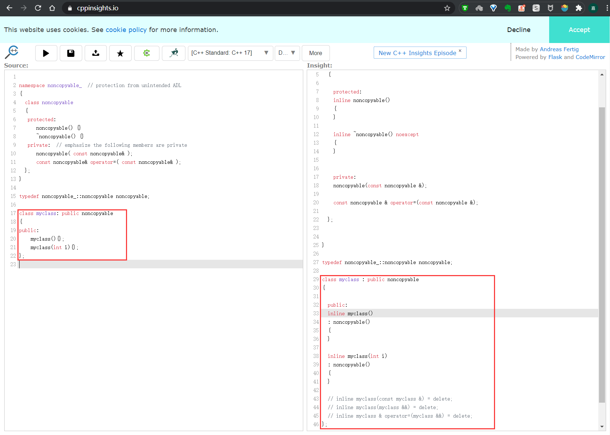

# C++ noncopyable 原理

noncopyable 用于禁止派生类的拷贝操作。使用很简单，当某一个类不希望进行拷贝操作时，继承 noncopyable 即可，这么做可以避免编译器自动生成默认的拷贝构造函数和拷贝赋值运算符。

我们来看看 noncopyable 的两种实现方式：

C++ 11 引入了 delete 语义，因此我们可以这样实现 noncopyable 

```C++
class noncopyable {
public:
    noncopyable(const noncopyable &) = delete;
    noncopyable& operator=(const noncopyable &) = delete;
protected:
    noncopyable() = default;
    ~noncopyable() = default;
};
```

而 boost 库里的实现方式如下：

```C++
class noncopyable
{
protected:
    noncopyable() {}
    ~noncopyable() {}
private:  // emphasize the following members are private
    noncopyable( const noncopyable& );
    const noncopyable& operator=( const noncopyable& );
};
```

两者的区别在于第一个使用了 delete 语义，而 boost 库里将拷贝构造函数和拷贝赋值运算符的访问修饰符定义为 private 。这种操作为什么可以实现派生类的不可拷贝呢？

"《C++ Primer 第5版》15.7.2 合成拷贝控制与继承" 这一章节里有如下内容：

> 如果基类中的默认构造函数、拷贝构造函数、拷贝赋值运算符或析构函数是被删除的函数或者不可访问，则派生类中对应的成员将是被删除的，原因是编译器不能使用基类成员来执行派生类对象基类部分的构造、赋值或销毁操作。

也就是说上述两种方式，第一种相当于基类的拷贝构造函数、拷贝赋值运算符是**被删除的函数**，而 boost 库里是**不可访问的函数**，因此其派生类对应的成员会被编译器生成是被删除的。这个就是 noncopyable 的核心原理。

我们可以来验证下，使用 [C++ Insights](https://cppinsights.io/) 查看代码编译展开后的结构。

我们在左侧构造了一个 myclass 类，令其继承 noncopyable ，右侧显示编译器将代码展开后的结果，多了如下两项：

```C++
inline myclass(const myclass &) = delete;
inline myclass & operator=(myclass &&) = delete;
```



