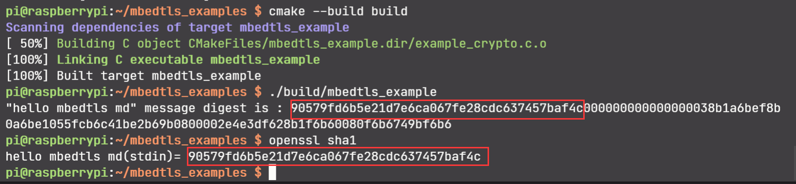

# Message Digest (MD)

**消息摘要**（Message Digest）函数，有时也被称为**单向散列函数**，用于计算消息的“指纹”，可用于验证消息的完整性，有以下特性：

1. 消息摘要的输入是**任意长度**的比特序列，而其输出是**固定长度**的值。
2. 消息摘要函数的计算速度很快，能够快速计算出大文件的消息摘要。
3. 消息不同，消息摘要也不同，哪怕消息中只有 1 比特的不同，消息摘要也会不同。

消息摘要在密码学中主要用于保障消息的**完整性**，也会用于**认证**消息，以及数字签名，伪随机数生成器等。

---

以下介绍 mbedtls 里使用 MD 的方式：

mbedtls 里用 `mbedtls_md_context_t` 这个结构体代表 MD 的内部状态，我们将其当做透明对象使用即可，`mbedtls_md_info_t` 包含我们选用的消息摘要算法，例如 MD5, SHA1, SHA3。

可以使用 `mbedtls_md_list()` 函数获取所有的 MD 算法，用 `mbedtls_md_info_from_string()` 可以根据 MD 算法的名称获取 `mbedtls_md_info_t` 对象，而用 `mbedtls_md_info_from_type()` 则是根据 enum 值来获取对象。

一般进行消息摘要计算的流程如下：

使用 `mbedtls_md_init()` 初始化 MD 内部状态，利用 `mbedtls_md_info_from_string/type()` 获取 MD 算法对象，然后用 `mbedtls_md_setup()` 函数将 MD 内部状态绑定一个 MD 算法，这样整个 MD 算法就初始化完毕了，再调用 `mbedtls_md_starts()` 开启计算，多次调用 `mbedtls_md_update()` 传入字节序列，当所有数据传输完毕后，调用 `mbedtls_md_finish()` 将 MD 的计算值输出给用户，最后调用 `mbedtls_md_free()` 释放 MD 内部状态。

以计算 "Hello mbedtls md" 的消息摘要为例，代码如下：

```C
#include <stdio.h>
#include <assert.h>
#include "mbedtls/md.h"

int main(int argc, char const *argv[])
{
    char buf1[] = "hello mbedtls";
    char buf2[] = " md";
    char output[MBEDTLS_MD_MAX_SIZE];
    mbedtls_md_context_t md_ctx;
    const mbedtls_md_info_t   *md_info = NULL;

    md_info = mbedtls_md_info_from_string("SHA1");
    assert(md_info != NULL);    

    mbedtls_md_init(&md_ctx);
    
    mbedtls_md_setup(&md_ctx, md_info, 0);
    mbedtls_md_starts(&md_ctx);
    mbedtls_md_update(&md_ctx, buf1, sizeof(buf1)-1);
    mbedtls_md_update(&md_ctx, buf2, sizeof(buf2)-1);
    mbedtls_md_finish(&md_ctx, output);

    printf("\"%s%s\" message digest is : ", (char *)buf1, (char *)buf2);
    for (size_t i = 0; i < MBEDTLS_MD_MAX_SIZE; i++) {
        printf("%02x", output[i]);
    }
    printf("\n");

    mbedtls_md_free(&md_ctx);

    return 0;
}
```

运行上述代码，可以得到 SHA1 消息摘要算法对 "hello mbedtls md" 的计算结果为：90579fd6b5e21d7e6ca067fe28cdc637457baf4c 。并利用 openssl 验证得到了一样的值。

