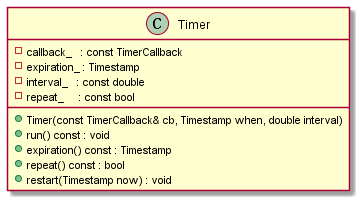
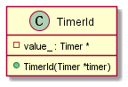
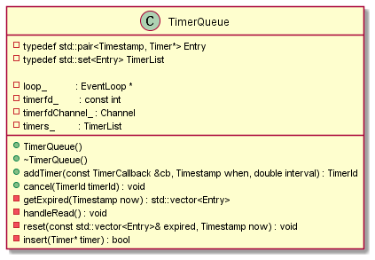

# TimerQueue

## Timer

该定时器 Timer 实现较简单，构造函数 `Timer()` 的第一个参数 `cb` 是该定时器触发时调用的回调函数，第二个参数 `when` 是该定时器触发时的时间戳，第三个参数 `interval` 是该定时器周期性触发的间隔时间，若只想使用单次触发的功能，此参数传入 0 即可。

注意：该 Timer 并不自己主动管理触发操作，而是将相应接口留了出来。

使用 Timer 的用户可以通过 `expiration()` 查看该定时器超时的时间戳，若大于当前时间戳，则调用 `run()` 函数，然后再调用 `restart()` （只有周期性定时器才能使用）函数重新启动该定时器。可以看出该定时器的超时触发处理，回调函数调用，以及周期性定时都是使用者手动操作的，因此不适合需要精准定时的场合。

可以用 `repeat()` 查看当前定时器是否支持周期性触发。

## TimerId

TimerId 仅仅持有一个 Timer 成员的指针。

一个不透明的标识符，用于取消计时器。

## TimerQueue

`getExpired()` 将已经超时的定时器从 `timers_` 里移除，并返回超时的定时器列表。

`addTimer()` 在给定的 `when` 时刻回调 `cb` 函数，当 `interval` > 0.0 时周期性该过程。