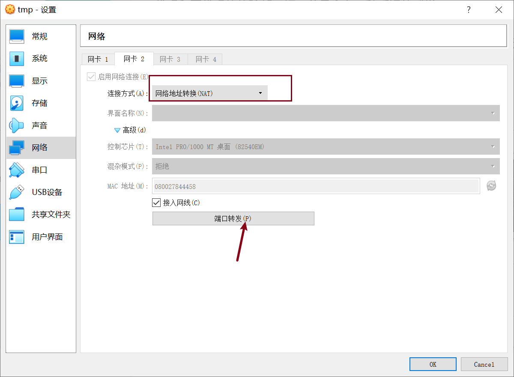
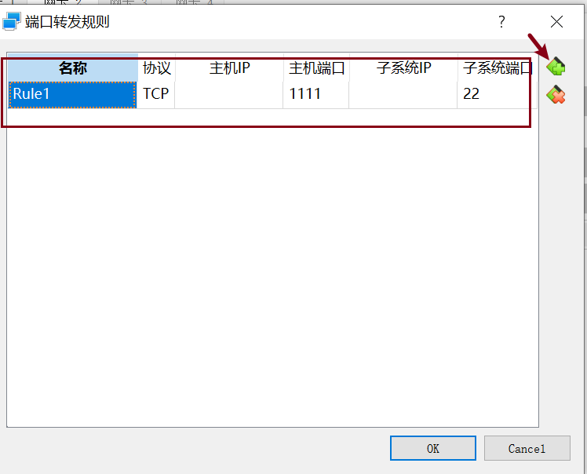
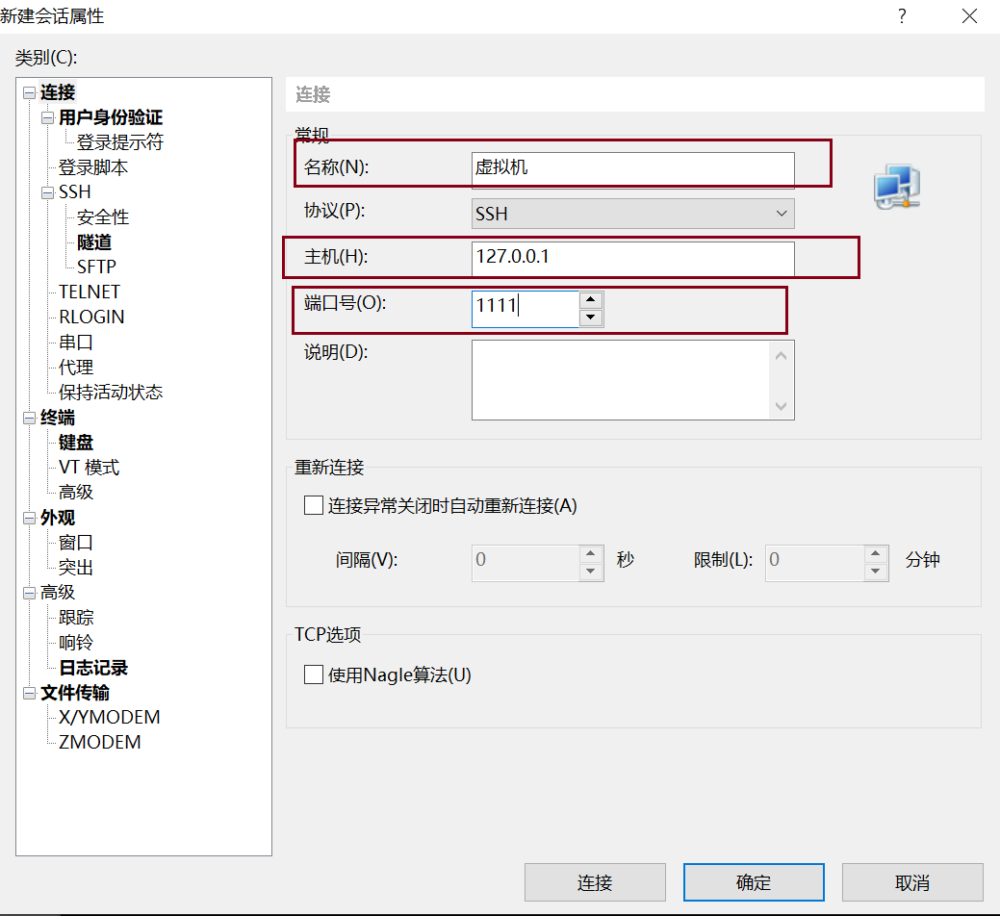
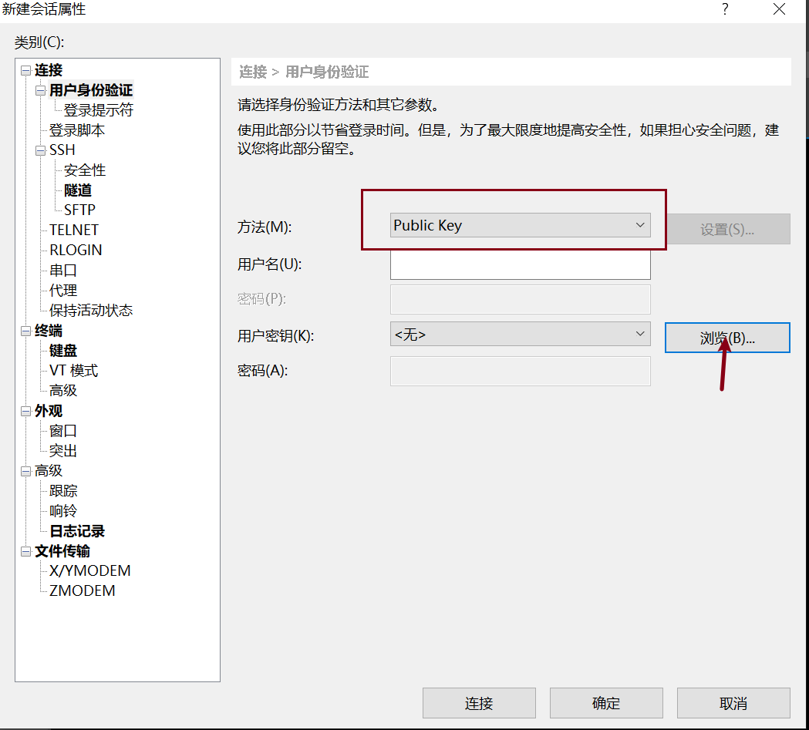
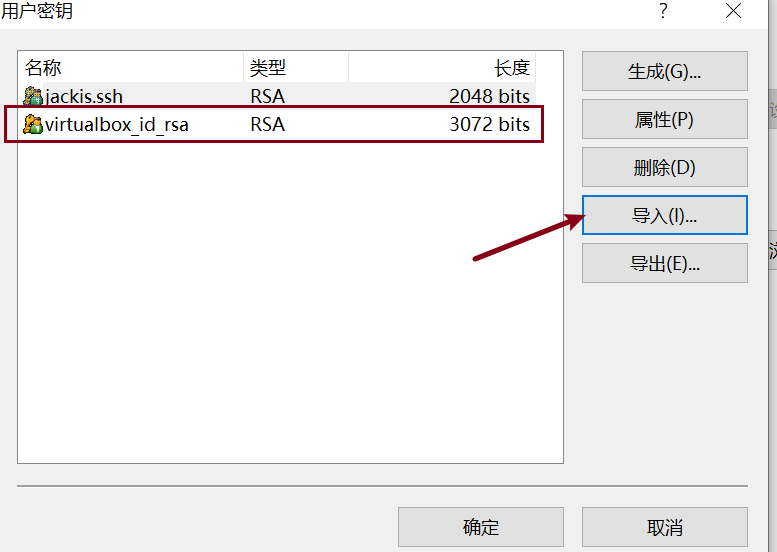
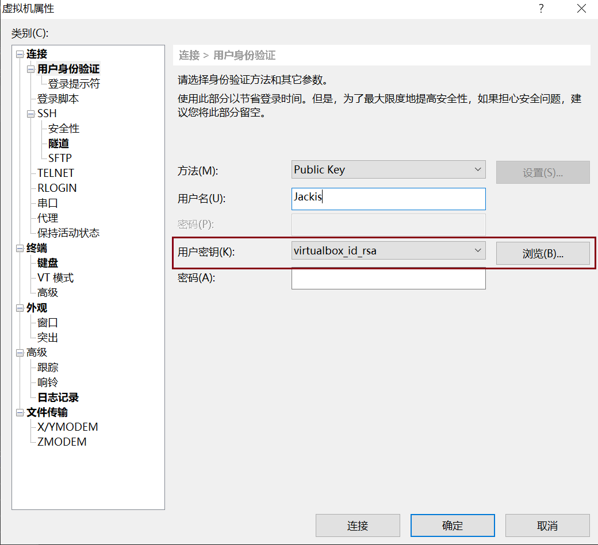

# VirtualBox Ubuntu ssh 密钥登录

我之前进行嵌入式开发时，利用 VirtualBox Ubuntu 搭建过开发环境，但是在虚拟机里面阅读代码和写代码的体验都不好，总是会有一种延迟的感觉。

于是我尝试了使用 Ubuntu 桥接网络，ssh 密码登录的方式登录虚拟机进行开发，但这种开发方式也有两个问题：

1. 由于是桥接网络，Ubuntu 与物理机是在同一个局域网，也就是说物理机如果处于不同的路由器下（比如公司和家里），它所属的局域网也不一样，因此 Ubuntu 利用 DHCP 会自动获得一个新的 IP 地址，这就导致需要手动输入 Ubuntu 的 IP 地址才能连上。在此应用场景下将 Ubuntu 的 IP 地址设置为静态地址也没用。
2. 每次登录都需要输入密码，重新连接时也需要输入密码，尤其是利用 VSCode 连接 Ubuntu，一段时间没有操作后，就需要你输入密码重新登录，十分繁琐。这里还不需要考虑密码登录的安全性问题，光是这些麻烦在实际应用中就很头痛了。

下面我介绍一种 Ubuntu 采用网络地址转换（NAT）上网，同时在 VirtualBox 配置主机和 Ubuntu 的端口转发规则，利用 ssh 密钥方式登录虚拟机。这能够完美解决上述的两个问题，算是对工具使用方式的改进吧，

## VirtualBox NAT 设置

新添加一个网卡 2，“连接方式”设置为“网络地址转换(NAT)”，然后点击“端口转发”。



点击右上角的 "+" ，创建一条新的端口转发规则，协议使用 TCP，子系统端口选择 22（ssh 登录的默认端口），主机端口需要选择一个未被使用的端口，我这里选择 1111 。点击 OK，就可以启动 Ubuntu 了。



关于如何在 Win10 查找某一端口是否被占用，可以参考博客[win10端口被占用如何查看](https://blog.csdn.net/oraclesand/article/details/77847255)。在命令行界面输入 `netstat -ano` 查看所有被占用的端口，`netstat -aon | findstr "8080"` 查找某一端口是否被占用。

```shell
C:\Users\M2019>netstat -aon | findstr "1111"
  TCP    0.0.0.0:1111           0.0.0.0:0              LISTENING       25840
```

## Ubuntu ssh 配置

输入 `sudo vim /etc/ssh/sshd_config` 编辑 ssh 的配置文件。

需要配置如下信息：

- 取消 `Port 22` 的注释。
- 取消 `PubkeyAuthentication yes` 的注释，并确保公钥认证后面为 yes。
- 取消 `AuthorizedKeysFile      .ssh/authorized_keys .ssh/authorized_keys2` 的注释。
- 取消 `PasswordAuthentication no` 的注释，并确保密码认证后面为 no 。

保持退出编辑后，输入 `sudo /etc/init.d/ssh restart` 重启 ssh 服务。

## ssh 密钥生成并上传

Win10 生成 ssh 密钥可参考博客：[Windows下生成SSH密钥](https://www.jianshu.com/p/2790a860f151) 。

利用 `ssh-keygen` 生成密钥对（公钥、私钥）。我这里生成的私钥名称为 **virtualbox_id_rsa**，公钥名称为 **virtualbox_id_rsa.pub** 。

然后就需要上传公钥到服务器了，这样我们就可以使用私钥去连接服务器。

在 Ubuntu 服务器里，输入

```shell
jackis@jackis-VirtualBox:~$ cd .ssh/
jackis@jackis-VirtualBox:~/.ssh$ vim virtualbox_id_rsa.pub
```

将之前生成的公钥(virtualbox_id_rsa.pub)里的内容复制到服务器里，保存并退出编辑。

输入下述命令将该公钥加入 ssh 的认证密钥。

```shell
jackis@jackis-VirtualBox:~/.ssh$ cat virtualbox_id_rsa.pub >> authorized_keys
```

如此便完成了公钥的安装。为了确保连接成功，请保证以下文件权限正确：

```shell
jackis@jackis-VirtualBox:~/.ssh$ chmod 600 authorized_keys
jackis@jackis-VirtualBox:~/.ssh$ chmod 700 ~/.ssh
```

然后输入 `sudo /etc/init.d/ssh restart` 重启 ssh 服务。

## 私钥登录服务器

这是 Ubuntu 服务器端的 ssh 已经配置好了，我们就可以利用私钥去登录 Ubuntu 了，此处记录 XShell 和 VSCode 两种登录方式。

### XShell

新建一个会话，在左侧“连接”选项栏里，“名称”可以随意更改，我这里为**虚拟机**，“主机”里的内容为 127.0.0.1，“端口号”为前面 VirtualBox 设置的端口转发规则的端口号，我这里为 1111 。



点击左侧的“用户身份验证”，“方法”选择 **Public Key** ，然后点击“用户密钥”右侧的“浏览”。



然后点击“导入”，将之前生成的私钥文件导入，导入成功就能够在左侧看到私钥了。点击“确定”。



在“用户密钥”这里选择刚才导入的私钥文件，“用户名”这里输入登录的用户账户，点击确定。



此时就能够正常通过私钥连接服务器了。

### VSCode

我这里使用 VSCode 的 **Remote - SSH** 插件连接虚拟机，需要配置一些内容。

打开 VSCode Remote - SSH 插件配置文件，默认在 C:/Users/<username>/.ssh/config 。

添加下述内容：

```shell
Host 虚拟机
  HostName 127.0.0.1
  Port 1111
  User jackis
  IdentityFile C:/Users/M2019/.ssh/virtualbox_id_rsa
```

- Host 是主机在插件处显示的名称。
- HostName 是主机的 IP 地址。
- Port 是主机的端口。
- User 是登录账户。
- IdentityFile 是你的私钥的完整路径名。

配置完成后，即可正常连接虚拟机了。

----

如果配置过程中出现了错误，欢迎在下方留言一起交流。